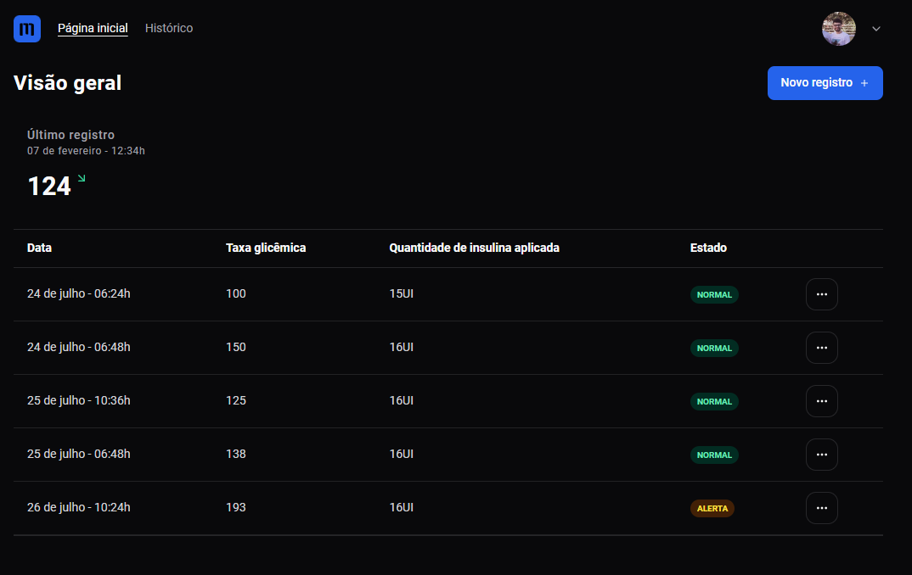
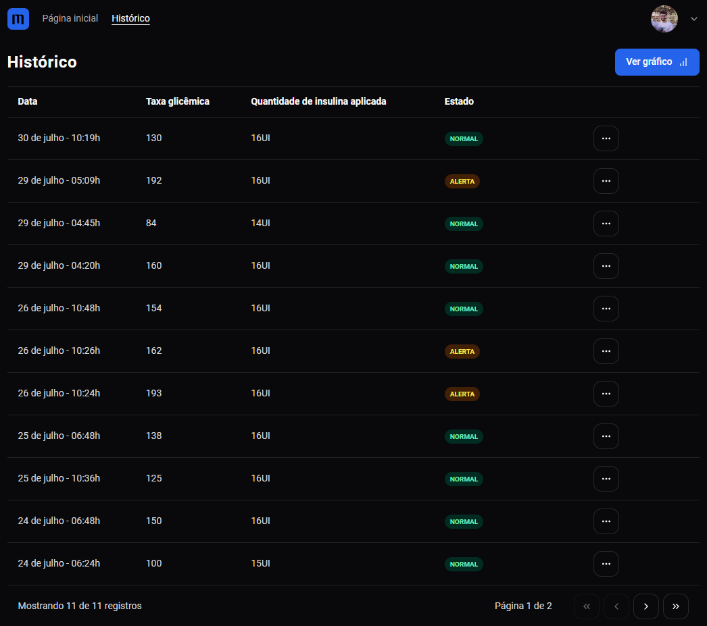

## Mila


# Descrição
É uma aplicação web criação de histórico glicémico.


## Funcionalidades
- Autenticação com clerk.js
- Criação de registro
- Paginação
- Gráficos

## Stack utilizada
- React.js
- Clerk.js
- React Router Dom
- React Hook Form
- Zod
- Recharts
- React Query
- TailwindCSS
- Tailwind Variants
- Tailwind Merge
- Date fns
- Lucide React

## Instalação

Após clonar o repositório, vá até a pasta do projeto e siga os comando abaixo:

```bash
 - pnpm install
 - pnpm dev
```
